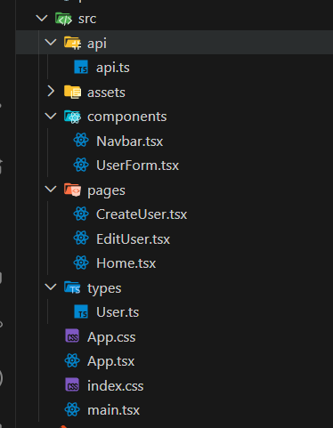

User Management Application

A React + TypeScript CRUD application for managing users. The app uses JSONPlaceholder API to simulate backend operations (fetch, create, update, delete users). Fully responsive and styled with Tailwind CSS.

📸 Screenshots
Home Page: 

Create User: 

Edit User: 

Mobile View: 

⚡ Features
✅ Core Features

Fetch Users – Displays a list of users from JSONPlaceholder with name, email, and phone.

Create User – Form to add a new user (POST request simulated).

Edit User – Pre-filled form to update user data (PUT request simulated).

Delete User – Delete user with simulated DELETE request.

Responsive Navbar – Hamburger menu on mobile.

Loading Spinner – While API requests are in progress.

Error Handling – Displays alerts or messages if API fails.

Styled with Tailwind CSS – Responsive and modern UI.

Optional / Advanced

TypeScript for type safety.

Smooth UI interactions and transitions.

🛠 Tech Stack

Frontend: React (with Hooks) + TypeScript

Routing: React Router DOM

Styling: Tailwind CSS

API: JSONPlaceholder (https://jsonplaceholder.typicode.com/
)

📁 File Structure

Getting Started
Prerequisites

Node.js ≥ 18

npm or yarn

Installation

# Clone the repository
git clone https://github.com/your-username/user-management-app.git
cd user-management-app

# Install dependencies
npm install
# or
yarn install

Run Locally

# Start development server
npm run dev
# or
yarn dev

🔗 Live Demo

How to Use

Home Page – Lists all users fetched from API.

Add User – Click Add User in navbar → fill form → submit.

Edit User – Click Edit button in user table → update fields → submit.

Delete User – Click Delete button → confirms deletion (simulated).
